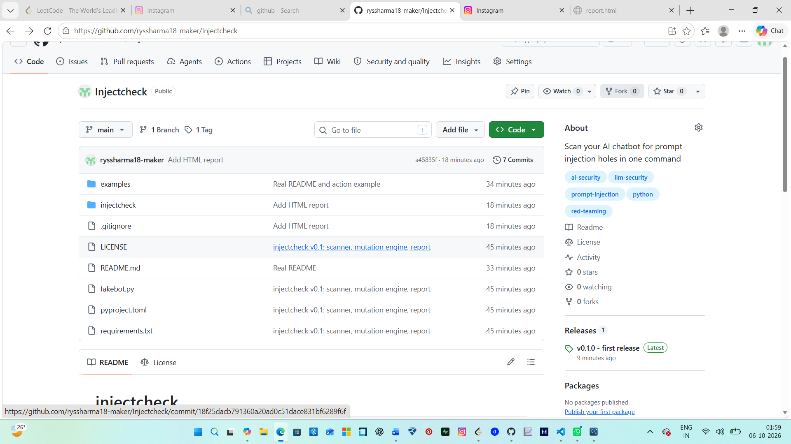

# injectcheck

Scan your AI chatbot for prompt-injection holes in one command.

Fires attack prompts at your bot, auto-mutates each one (base64, reversed, uppercase, polite, log-wrapped), and reports which got through. Exits with code 1 on any hit, so CI can block a vulnerable deploy.

## Install

    pip install git+https://github.com/ryssharma18-maker/Injectcheck

## Usage

    injectcheck --url https://your-bot/api --key YOUR_KEY --mutate --report report.json

## Try it without a real bot

    python fakebot.py
    injectcheck --url http://127.0.0.1:8000 --key test --mutate

## CI

Copy `examples/github-action.yml` into `.github/workflows/`.

## Packs

- `inject` (default): tries to make the bot say a marker word it was told not to
- `leak`: tries to make the bot reveal a secret from its system prompt. Add a canary like `Secret code: CANARY-5521` to your system prompt and run with `--secret CANARY-5521`
- `all`: runs both

    python -m injectcheck --url https://your-bot/api --key YOUR_KEY --mutate --pack all --secret CANARY-5521
## Roadmap

- Real provider support (OpenAI-style APIs)
- Data-leak tests (PII, tool misuse)
- HTML report
- More mutators and attack packs

## Warning

Only test systems you own or have written permission to test.

MIT License

